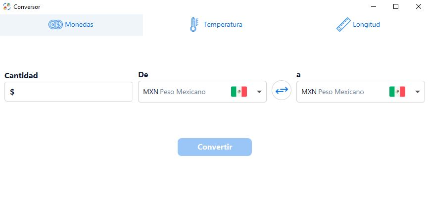
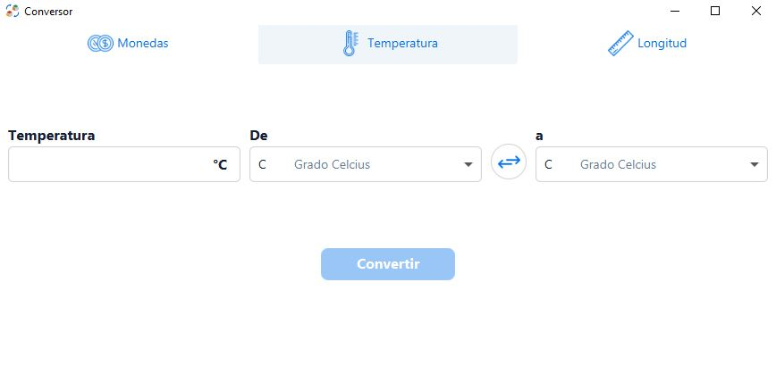
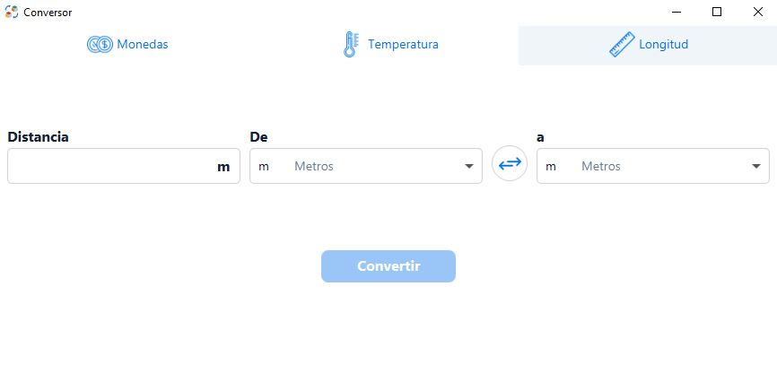
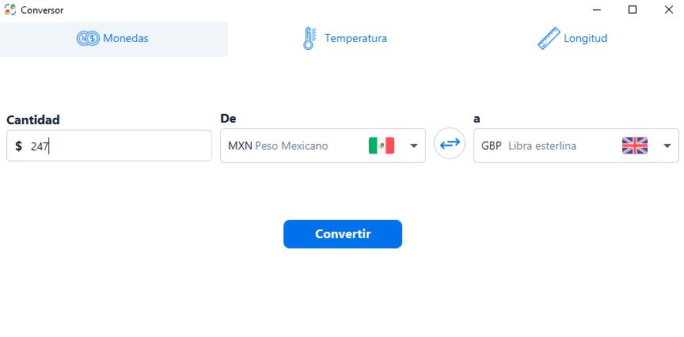
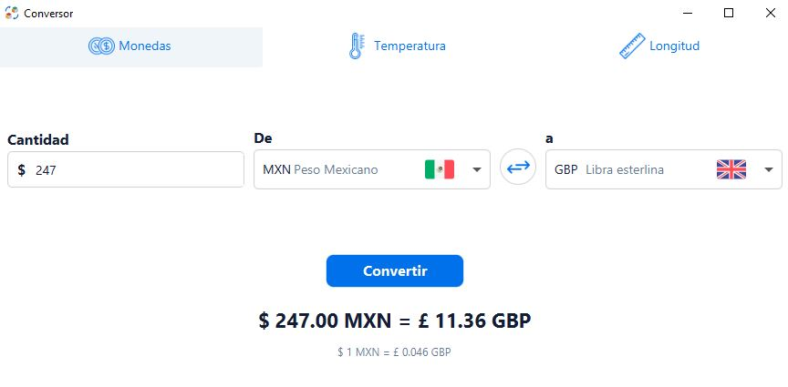
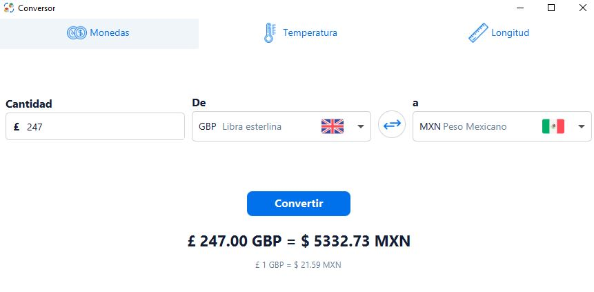
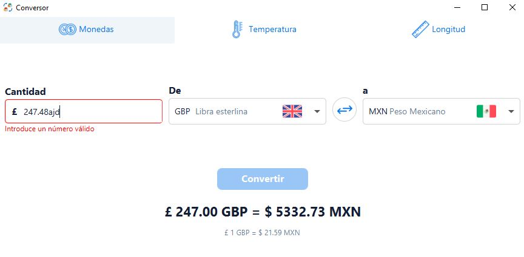

# Multifuncional Converter

This project is a multifunctional converter developed as part of a challenge from the Oracle Next Education program.

The challenge was to develop a currency converter, but I decided to implement a length 
and temperature converter as well.


## Features

- **Currency converter**
    - Convert between the following currencies:
        - mexican pesos
        - american dolars
        - euros
        - sterling pounds
        - south korean won
        - japanese yen
- **Length converter**
    - Convert between the following units:
        - meters *[m]*
        - kilometers *[km]*
        - centimeters *[cm]*
        - millimeters *[mm]*
        - miles *[mil]*
        - feet *[ft]*
        - yards *[yd]*
- **Temperature converter**
    - Convert between the following units:
        - Celcius *[°C]*
        - Kelvin *[°K]*
        - Fahrenheit *[°F]*

## Demo

1. Choose between the three converter types.





2. Select the options you want to convert each other and add the input value.
   
)

3. The app displays the result
   
)

4. You can click the swap button and change the conversion order.
   
)

5. The app displays an error label when a non numeric value is written and the conversion button is disabled.
   
)


## Installation

- Clone this repository to your local machine.

```bash
  git clone https://github.com/Diegohrp/Challenge-ONE-CurrencyConverter.git
```

- Make sure you have Java 11 or higher installed and the JDK.

- Open the project in your preferred IDE.

- Build the project using Maven to resolve dependencies.
## Dependencies
- Java 11
- JavaFx for GUI
## Contributing

Contributions are always welcome!

If you find bugs or want to add something more, follow these steps:

- Fork the repository.

- Create a new branck for your feature.

- Make your changes and commit with a descriptive message.

- Push your changes to the repository

- Open a pull request.
## License

This project is under the MIT License

[MIT](LICENSE)


## Authors
This project was developed by Diego Herrera Prado [@Diegohrp](https://github.com/Diegohrp/Challenge-ONE-CurrencyConverter) as part of a challenge from the Oracle Next Education program.

Feel free to reach out if you have any suggestion or if you want to work with me 😀.

